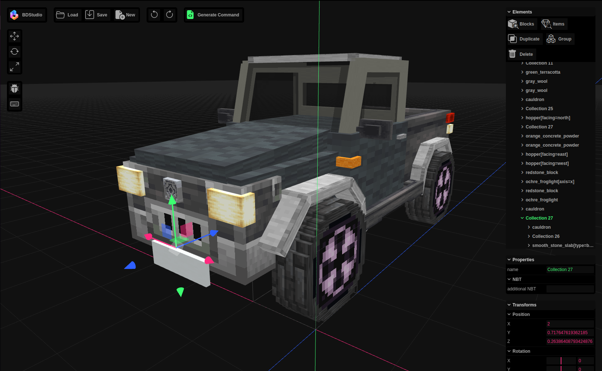

\
&nbsp;
\
&nbsp;

# Block Display Studio
A 3D editor and command generator for Minecraft block display and item display entities.

BDStudio is an innovative editor designed specifically for Minecraft’s display entities. With the introduction of display entities in Minecraft 1.19.4, builders and creators now have the ability to bring their creations to life in new and exciting ways.

BDStudio simplifies the process of working with display entities, making it easier for players to design and customize their Minecraft projects. It offers a range of tools and features that enable users to create intricate displays with ease. Whether it’s showcasing artwork, creating interactive exhibits, or designing immersive experiences, BDStudio empowers Minecraft players to unleash their creativity and bring their ideas to life.

The editor provides a user-friendly interface, allowing users to easily manipulate display entities, adjust their positions, rotations, and scaling, and even apply custom NBT tags. BDStudio opens up a world of possibilities for creating captivating visual displays within the Minecraft universe.
\
&nbsp;
\
&nbsp;

## Videos showcasing BDStudio
---

") 
### 30 Build Hacks Using COMMANDS! (No Mods!)

---

 
### Minecraft 1.20 Update With INSANE Detail

---
\
&nbsp;
\
&nbsp;

# Changelog
[Check out my blog on the latest changes](https://eszesbalint.github.io/tags/#update)

## Beta 1.2.2 Changes
- Group command no longer hangs if no objects were selected
- Block models are now stored in memory under the corrected blockstate
- Added donation dialog
- Minor GUI changes

## Beta 1.2.1 Changes
- Icons in the Elemets list, to easily differentiate between block displays, item displays and collections
- Pixel grid rendering issues fixed
- Added camera orientation gizmo in the corner 

## Beta 1.2 Changes
- Added support for item displays
- Redesigned GUI:
    - Added top toolbar for file operations
    - Element tools (Add, Duplicate, Group, Delete) are moved to the Elements tab
    - Added title for several buttons for easier navigation
    - Modal windows for Version, Command, Block Search, Item Search
    - New color palette
    - New logo design
    - Icon changes
    - Limited support for mobile devices
- Unloadable block states and item models now display a placeholder model
- Multipart models now properly support AND and OR clauses
- Optimized geometry for models

## Beta 1.1.2 Changes
- Added replace functionality. Clicking on a blockstate in block search now will replace the selected block display, or add a new block display if a collection is selected.
- Selecting an object in the 3D viewport now will succesively traverse the project tree. So for example if you click on a block display that is inside a collection, first click will select the collection, second click will select the block display itself. 

## Beta 1.1.1 Changes
- New duplicates and new groups are selected automatically
- Setting scale to 0 no longer causes NaN values
- All blocks with rotated elements in them now render porperly (mostly affects plants and rails)
- Fixed texturing issues of blocks with animated textures
- Removed unloadable blockstates (chests, signs, banners, skulls... etc)

## Beta 1.1 Changes
- Updated for Minecraft 1.20
- Added Undo / Redo functionality
- Faster loading
- Added multi-level grouping and editing
- Collections can be named now
- Additional NBT tags can be inserted for block displays and collections (block displays will inherit the collection's NBT tags)
- Improved rendering of transparent objects
- Projects can be named now
- Added loading animation
- Long commands are now broken up into several commands to respect Minecraft's command length limit of 32500